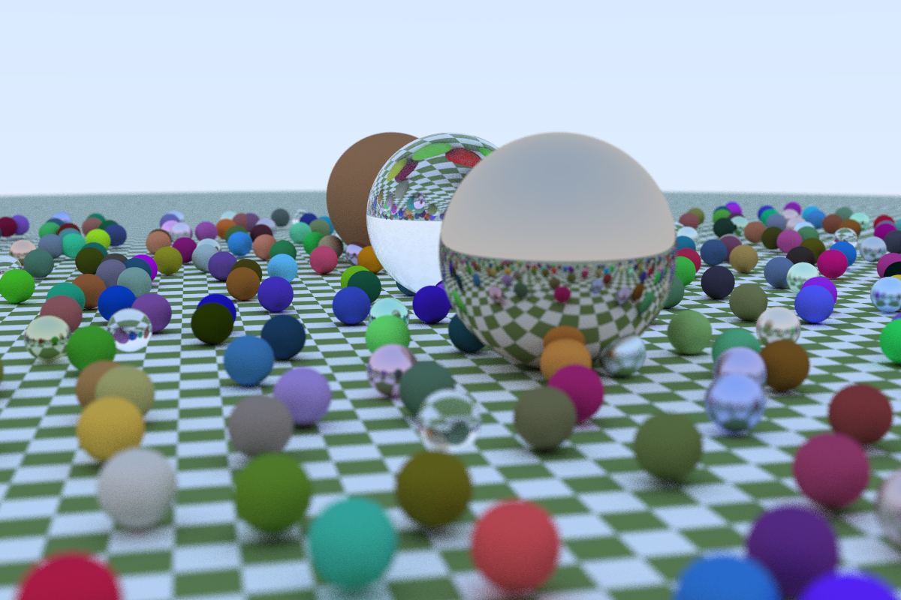
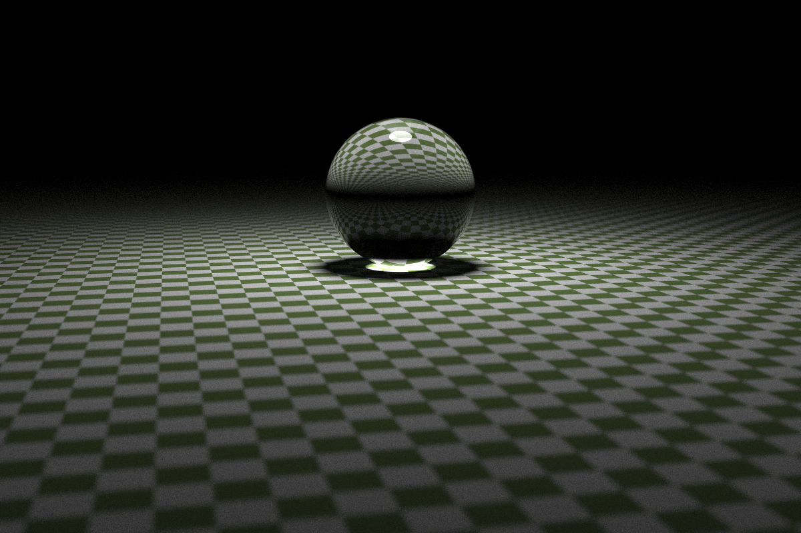

# ray-tracing-in-one-weekend-rust

reference: https://raytracing.github.io/books/RayTracingInOneWeekend.html

reference scene

textured scene

scene with light

5x5 cube

floating and metal world

